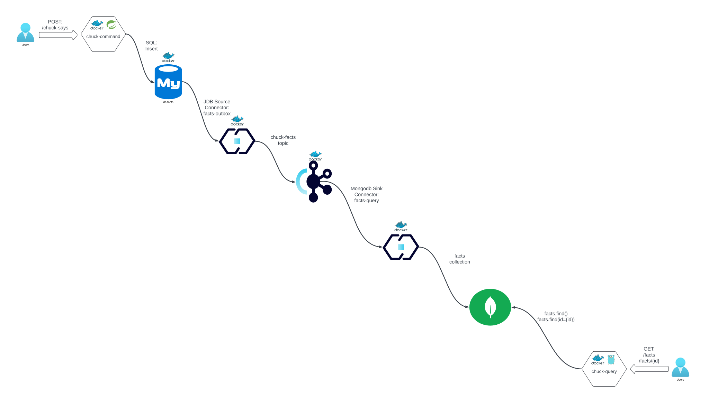

# Arquitectura de Micorservicios

En este ejemplo mostramos un ejemplo sencillo de implementación de los siguientes patrones de arquitectura vistos en el modulo:



1. **chuck-command**: Servicio Springboot que expone un API Rest con un solo endpoint: `POST: /chuck-says` e inserta el resultado en la tabla `db.facts` de MySQL
2. **fact-outbox connector**: Kafka Connect JDBC Source Connector que escribe en el topic `chuck-facts` la fila que se escribe en la tabla `db.facts` usando formato AVRO.
3. **fact-query connector: Kafka Connect JDBC Sink Connector que lee el topic `chuck-facts` y escribe un nuevo documento en la coleccion `test.facts` respetando el formato expuesto en el schema avro del topic.
4. **chuck-query:**Servicio GOLANG que expone dos enpoints rest: `GET: /facts` y `GET: /fact/{id}` que ejecutan queries sobre la coleccion `test.facts` de MongoDB y devuelve la estructura del documento en formato `JSON`

Patrones de interación/arquitectura implementados:

1. **Comunicación Síncrona Request/Reponse:** Servicios Chuck Command/Query
2. **Outbox Pattern:**El servicio `chuck-command` escribe en la base de datos de manera transaccional, el conector `fact-outbox` disponibiliza la entrada como evento en el topic `chuck-facts` asegurando así la `consistencia eventual`.
3. **CQRS:**El conector `facts-query` lee el contenido del topic `chuck-facts` y escribe en la colección mongo asegurando la segregación entre comando y query (de nuevo asegurando una consistencia eventual) y dotando al servicio `chuck-query`de una infraestructura optimizada para la lectura.

## Arrancar el ejemplo

La carpeta environment contiende un `docker-compose` con toda la infraestructura necesaria para ejecutar el ejemplo.

Para insertar un nuevo `fact` en la BBDD, ejecutamos una request de tipo POST al servicio `chuck-command` expuesto por el puerto `28080`:

```bash
curl -X POST  http://localhost:28080/chuck-says
```

Para buscar todos los `facts` disponible, ejecutamos una request tipo GET al servicio `chuck-query` expuesto en el puerto `38080`:

```bash
curl http://localhost:38080/facts
```

Para buscar un `fact` concreto, ejecutamos una request tipo GET parametrizada con el `id` del fact a buscar al servicio `chuck-query` expuesto en el puerto `38080`:

```bash
curl http://localhost:38080/fact/1
```